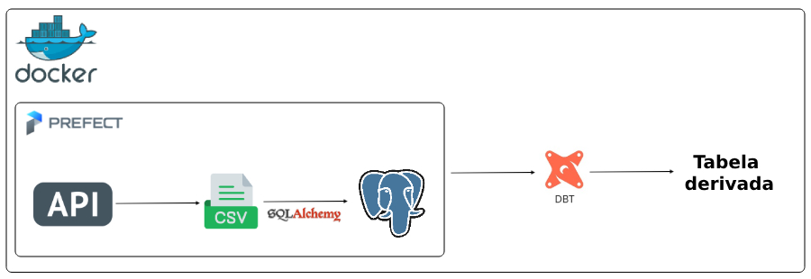

#  Projeto Engenharia de Dados: Consumo de Dados GPS do BRT

## Introdução

Este projeto tem como objetivo capturar, estruturar, armazenar e transformar dados da API de GPS do BRT do Rio de Janeiro. Os dados são gerados com o último sinal transmitido por cada veículo.

A solução será implementada utilizando Prefect para orquestração do fluxo de extração e carga dos dados, e DBT para transformar e criar tabelas derivadas no banco de dados PostgreSQL.


## Tecnologias Utilizadas
-   **Python**: Linguagem principal para fazer requisições à API e processar os dados.
    
-   **Prefect** (1.2.2): Ferramenta de orquestração para a extração e carga incremental dos dados.
    
-   **PostgreSQL**: Banco de dados para armazenar os dados brutos e transformados.
    
-   **DBT (Data Build Tool)**: Ferramenta para realizar as transformações e criar tabelas derivadas.
    
-   **Docker**: Para containerizar o ambiente e garantir a portabilidade da solução.


## Arquitetura



## Etapas da construção do projeto


### 1. Análise do funcionamento da API
Para este projeto, foi essencial entender como a estrutura dos dados eram gerados e como as atualizações ocorriam, pra isso pesquisei a [documentação](https://www.data.rio/documents/3ce6c6dc62b14a779dc7a6d2e22ed921/about) da API de posição geográfica de veículos do BRT e observei a estrutura dos dados gerados. Foi utilizado o método GET para obter os dados necessários.

### 2. Lógica da tasks do Prefect

As tasks em [tasks](src/tasks.py) organizam o fluxo de **extração, processamento e armazenamento** dos dados da API de mobilidade do BRT do Rio de Janeiro. O objetivo principal é garantir que os dados sejam extraídos, processados e armazenados corretamente no banco de dados seguindo um fluxo.

1.  **Extração**: A task `request` realiza a requisição HTTP para obter os dados em tempo real.
2.  **Nomeação de Arquivo**: `gerar_nome_arquivo` cria um nome único para armazenar os dados com base no timestamp.
3.  **Armazenamento Local**: `salva_arquivo_json` salva os dados em um arquivo JSON, permitindo persistência temporária.
4.  **Conversão e Processamento**: `carregar_dados_json` lê os dados salvos para posterior armazenamento
5.  **Criação da Estrutura no Banco**: `criar_schema` e `criar_table` garantem que o banco de dados esteja preparado para receber os dados.
6.  **Inserção no Banco**: `inserir_dados_db` insere os registros extraídos na tabela correspondente.


## Pré-Requisitos

-   Python (3.10)
-   Docker
-   Docker Compose

## Executando o Projeto

Siga os passos abaixo para executar este projeto:

1. Copie o diretório do projeto para uma pasta local em seu computador.
2. Abra o terminal do seu computador e mova até o diretório do projeto.

##### Configurando credenciais
Caso não seja necessário, você pode rodar com as configurações padrão. Se você precisar modificar as configurações:
- Há alguns locais onde você deve modificar para as suas credenciais:
	-	No diretório principal do projeto, modifique a POSTGRES_PASSWORD do arquivo docker-compose.yml, responsável por definir a senha do banco de dados postgresql.
	-	No diretório prefect-server modifique a .env para os dados do seu banco de dados postgresql.
	-	Crie um arquivo profiles.yml para rodar o DBT no seguinte diretório ~/.dbt/ com as configurações abaixo:
```
dbt_brt:
  outputs:
    dev:
      dbname: dados_api
      host: localhost
      pass: Postgres2019! # modifique caso precisar
      port: 5434
      schema: stag_brt
      threads: 1
      type: postgres
      user: postgres
  target: dev
```

Agora que já configuramos nosso projeto, podemos retornar ao nosso passo de execução:


3. Navegue até o diretório prefect-server, vamos executar o docker compose pra subir o servidor do prefect. 
	- Utilize o seguinte comando para isso:  `docker compose -f docker-compose.yml up -d`
5. Após o servidor ficar em execução, vamos precisar instalar alguns requirementos no seu próprio terminal pra criar a tenant:
	- Primeiro vamos precisar utilizar o venv. 
		- Execute o seguinte comando no seu terminal: `python3 -m venv venv`
	- Após isso, vamos ativar o ambiente do venv. 
		- Execute o seguinte comando no seu terminal: `source venv/bin/activate`
	- Com isso, podemos instalar o prefect. 
		- Execute o seguinte comando `pip install prefect==1.2.2`
	- Após instalar, precisamos dizer ao Prefect que nosso servidor é local. 
		- Execute o seuginte comando no seu terminal: `prefect backend server`
	- Por fim, vamos criar o tenant (espaço lógico para gerenciar fluxos de trabalho, execuções e agentes) para o prefect. 
		- Execute o seguinte comando no seu terminal: `prefect server create-tenant --name default --slug default`
6. Agora navegue até a pasta prefect-agent e vamos iniciar nosso agent que vai ser responsável por executar fluxos e tarefas. 
	- Execute o seguinte comando no seu terminal: `docker compose -f docker-compose.yml up -d`
7. Calma, estamos quase lá. Agora estamos pronto pra executar nosso fluxo. No diretório principal do projeto. 
	-	Execute o comando seu terminal: `docker compose -f docker-compose.yml up`

### DBT
Agora que nosso fluxo executou, precisamos realizar as transformações, certo? Você já definiu o profiles.yml, então agora é bem fácil.

-	Navegue até a pasta dbt_brt e execute o seguinte comando: `dbt run`